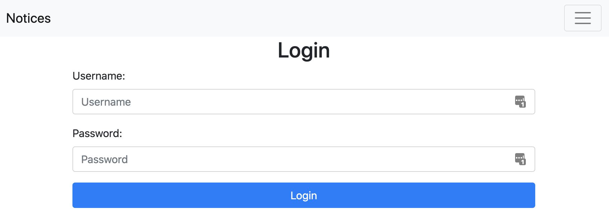
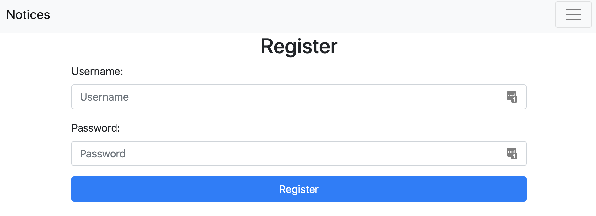
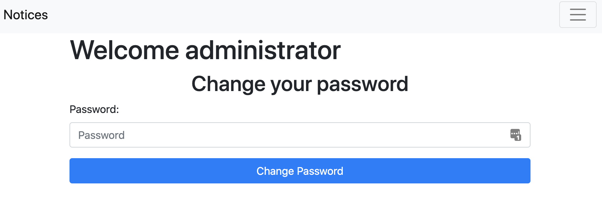
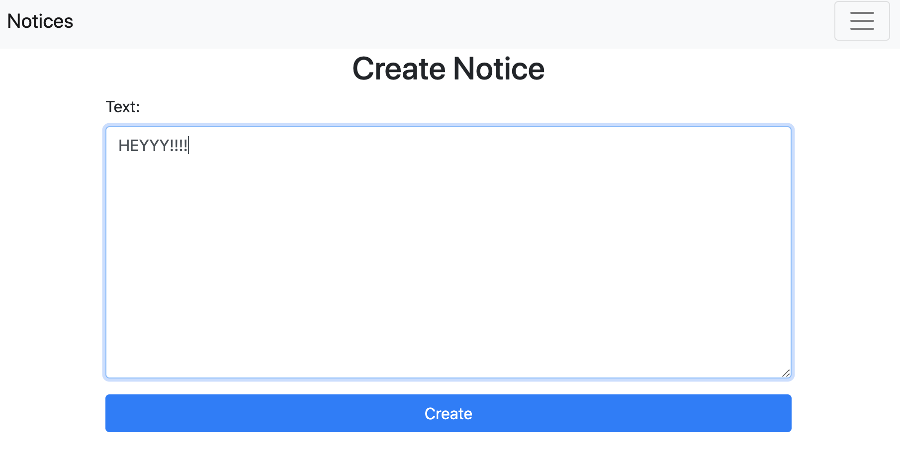
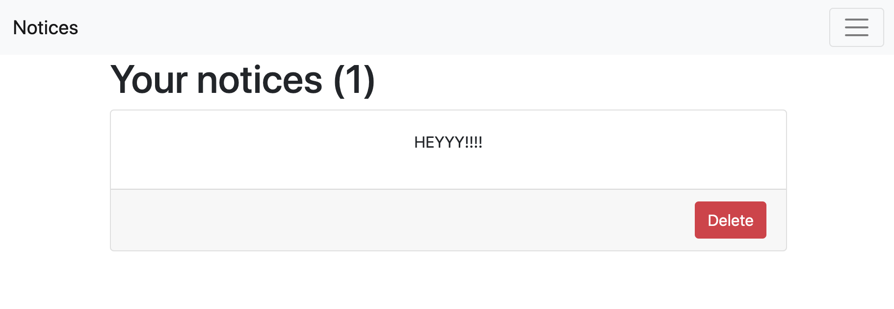

# PHP Note App

I decided to learn PHP without using frameworks. This project was not created to use it productively. If you have suggestions for improvement concerning code, you are welcome to make a Pull Request.

Create SQL database models:
```sql
CREATE TABLE users (
    id int unsigned AUTO_INCREMENT PRIMARY KEY,
    username varchar(30) not null,
    password varchar(100) not null,
    creation_date timestamp DEFAULT CURRENT_TIMESTAMP
);

CREATE TABLE notices (
    id int unsigned AUTO_INCREMENT PRIMARY KEY,
    text varchar(300) not null,
    creation_date timestamp DEFAULT CURRENT_TIMESTAMP,
    user_id int unsigned not null,
    FOREIGN KEY(user_id) REFERENCES users(id) ON UPDATE CASCADE ON DELETE CASCADE
);
```

## Screenshots:

### Login


### Register


### Change Password


### Create Note


### List notes



